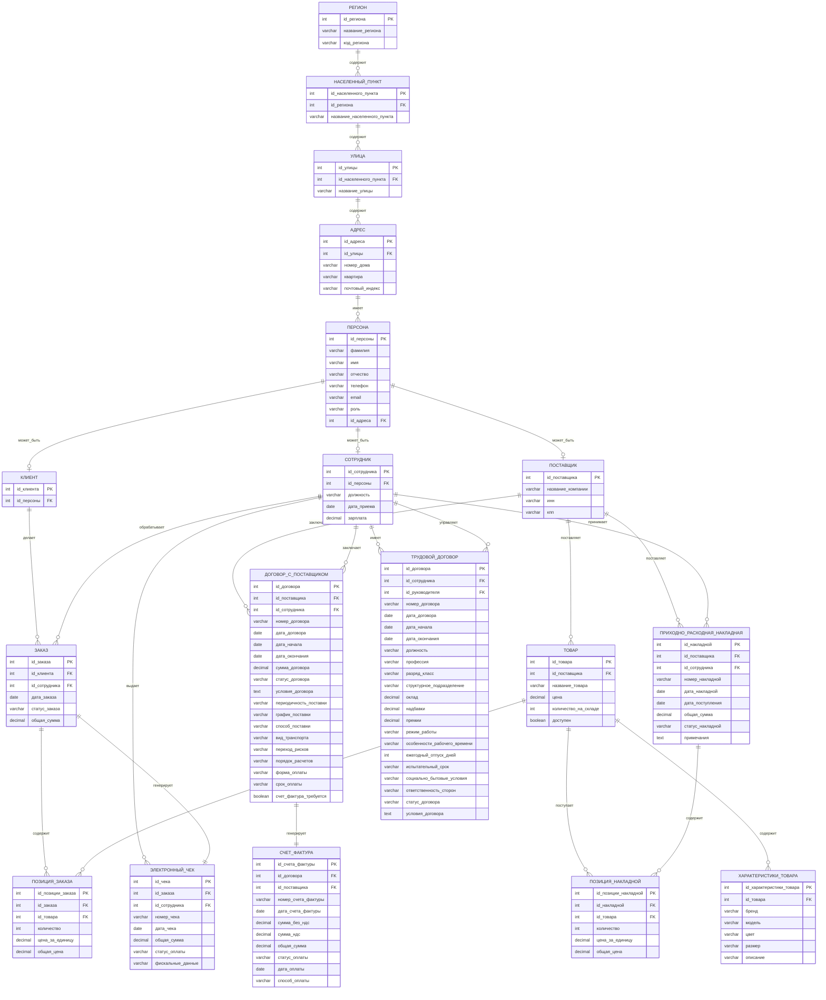

## Концептуальная схема базы данных

### Документооборот:
1. **Приходно-расходная накладная** - документ поступления товаров от поставщиков
2. **Трудовой договор** - документ найма сотрудников с детальными условиями работы
3. **Электронный чек** - документ продажи товара клиенту
4. **Договор с поставщиком** - документ сотрудничества с производителями, включая условия поставки
5. **Счет-фактура** - документ для учета НДС и расчетов с поставщиками

