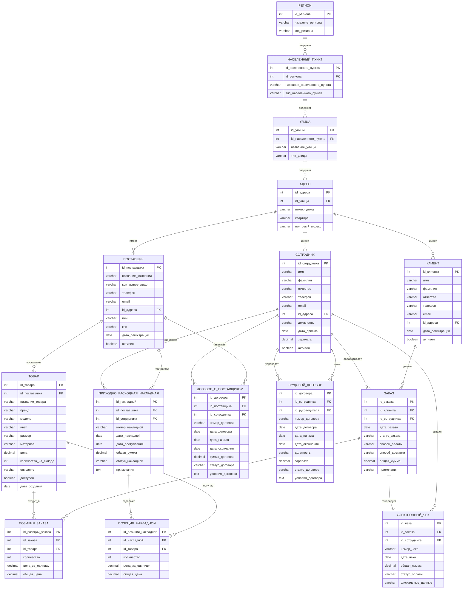

## Концептуальная схема базы данных

## Описание связей:

### Основные сущности:
1. **Клиент** - покупатели кроссовок с адресом доставки
2. **Заказ** - заказы клиентов с товарами и обработкой сотрудником
3. **Поставщик** - российские производители кроссовок
4. **Сотрудник** - персонал компании
5. **Товар** - кроссовки различных моделей от поставщиков

### Документооборот:
1. **Приходно-расходная накладная** - документ поступления товаров от поставщиков
2. **Трудовой договор** - документ найма сотрудников
3. **Электронный чек** - документ продажи товара клиенту
4. **Договор с поставщиком** - документ сотрудничества с производителями

### Адресная структура:
- **Регион** → **Населенный пункт** → **Улица** → **Адрес**
- Позволяет гибко работать с адресами по всей России
